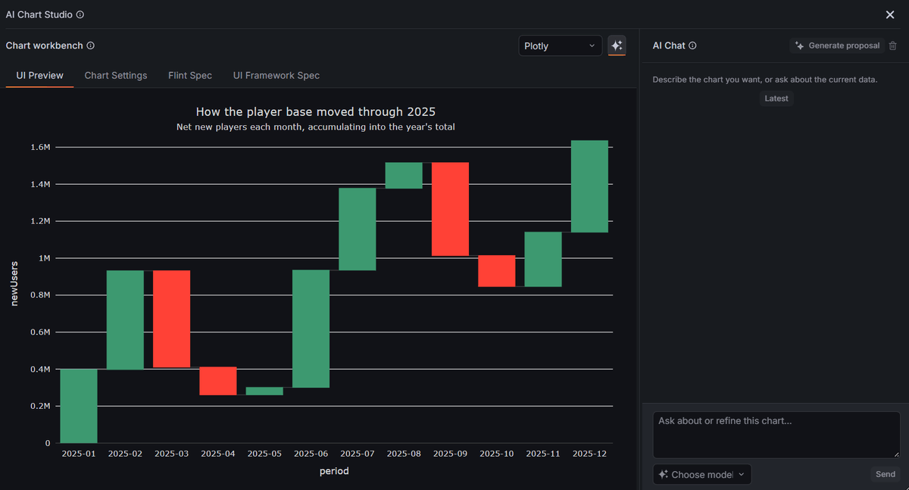
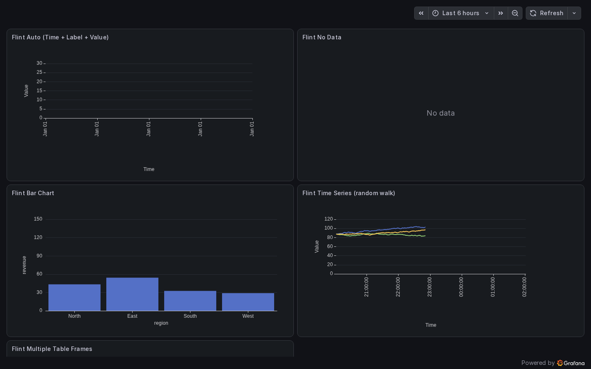

# Grafana Flint Panel

[English](README.md) | [简体中文](README.zh-CN.md)

Flint 是一个由 [Microsoft Flint](https://github.com/microsoft/flint-chart) 驱动的 Grafana AI 辅助可视化面板。在 AI Chat 中描述你想要的图表，基于当前 Grafana 查询数据生成提案，在实时预览中审查，然后明确应用到 Panel。Flint 随后通过 Apache ECharts、Vega-Lite、Plotly 或 Chart.js 完成渲染。

> [!WARNING]
> **项目状态：实验性的研究型概念验证（POC），尚未达到生产就绪。** 本仓库用于验证和评估 Flint、Grafana 与 AI 可视化提案的集成，不承诺稳定的兼容性或迁移路径。请将所有 AI 提案视为不可信输入：当前即使要求“只修改配色”，仍可能重新生成图表类型、字段绑定或 Flint Spec。点击 Apply 前必须检查预览和 Chart Settings。详见[项目状态与成熟度](docs/project-status.md)。

**AI Assist 是本项目的核心工作流。** 自动图表推断和 Chart Studio 手动配置作为可靠的补充能力继续保留。对话式生成通过单独安装的兼容 Flint AI 数据源完成，使 Provider 配置和凭据与 Panel 保持隔离。



## 核心特性

- 通过 AI Chat，结合当前 Grafana 查询上下文创建和迭代图表。
- 在实时预览中审查生成的草稿，再明确应用或放弃修改。
- 使用 Apache ECharts、Vega-Lite、Plotly 或 Chart.js 渲染已确认的图表。
- 需要更多控制时，可使用 Auto、手动设置或规范编辑器。

## 兼容性

| 组件             | 支持版本          |
| ---------------- | ----------------- |
| Grafana          | 12.3.0 或更高版本 |
| 开发环境 Node.js | 22 或更高版本     |
| 包管理器         | npm 10            |

浏览器测试覆盖最低支持的 Grafana 12.3 系列和当前 Grafana 13 系列。

## 快速开始

### 启动开发环境

```bash
npm ci
npm run build
docker compose up --build
```

打开 <http://localhost:3000>，进入 **Provisioned Flint dashboard**。默认 Compose 环境会构建并挂载当前 Panel，并使用 Grafana 内置的 TestData 数据源；不依赖相邻目录中的其他 datasource 仓库。

需要增量开发时，可在另一个终端运行：

```bash
npm run dev
```

### 使用 AI Assist 创建可视化

1. 在 Grafana Dashboard 中添加 Panel 并配置查询。
2. 选择 **Flint** 可视化。
3. 展开 **AI Assist** 并打开 **AI Chart Studio**。
4. 选择已配置的模型，在 **AI Chat** 中描述需要创建或修改的图表，然后发送请求。
5. 点击 **Generate proposal**，根据对话和当前查询上下文生成图表草稿。
6. 查看实时预览；需要时继续对话，或调整 Chart Settings、Flint Spec 和 UI Framework Spec。
7. 点击 **Apply to panel** 应用草稿，或点击 **Discard edits** 放弃修改。

如果尚未配置 AI Provider，可以保持 **Chart type** 为 **Auto**，或使用 Chart Studio 的手动配置功能。

## 渲染后端

| 后端           | 适用场景                               |
| -------------- | -------------------------------------- |
| Apache ECharts | 默认后端，适合大多数 Grafana Dashboard |
| Vega-Lite      | 声明式统计图表和可视化语法             |
| Plotly         | 交互式科学计算和统计图表               |
| Chart.js       | 常见场景下较轻量的 Canvas 图表         |

各渲染器采用按需加载，打开普通 Flint Panel 时不会一次性加载所有后端。



## Chart Studio

Chart Studio 是位于 Grafana Panel 编辑器内的 AI 辅助图表创建和审查工作区：

- **AI Chat** 根据当前数据上下文接收自然语言图表需求和后续修改要求。
- **Generate proposal** 将对话转换为经过校验、尚未应用的图表草稿。
- **UI Preview** 使用真实查询帧渲染当前 Panel 或 AI 提议的草稿。
- **Chart Settings** 提供可审查的图表类型和字段映射配置。
- **Flint Spec** 展示语义层可视化规范。
- **UI Framework Spec** 展示编译后的后端原生配置。
- **Apply to panel** 是 AI 提案与已保存 Panel 配置之间的明确边界。

草稿会绑定当前 Dashboard、Panel、查询和字段结构。如果这些上下文发生变化，过期草稿将无法直接应用。

## 工作原理

```text
Grafana 查询帧
  -> 构建脱敏的数据摘要和字段结构
  -> 与 AI Chat 请求及对话上下文组合
  -> 生成并校验 Flint 图表提案
  -> 在实时预览中暂存提案
  -> 编译 Flint chart specification
  -> 为选中的渲染后端生成配置
  -> 重放可选的无数据 framework override
  -> 明确应用并在 Grafana Panel 中渲染图表
```

AI 工作流直接使用已经绑定到 Grafana Panel 的查询帧，不会再引入第二套业务数据选择器。提案应用后，即使没有正在进行的 AI 请求，Panel 仍可继续渲染图表。

## AI Assist 配置与安全边界

单独安装并配置兼容的 Flint AI 数据源，然后在 AI Chart Studio 中选择其模型。服务不可用时，自动和手工创建图表的能力仍然可用。

该集成遵循以下安全边界：

- Provider 凭据归数据源管理，由 Grafana 存储在 `secureJsonData` 中。
- Flint Panel 和 Dashboard JSON 不保存 Provider API Key。
- 聊天记录有容量限制，并且仅临时保存在当前浏览器会话中。
- 发送给 Provider 的数据摘要会经过脱敏和大小限制，且不包含业务数据源身份。
- AI 生成的配置会根据当前查询字段进行校验。
- Flint Spec 和 UI Framework override 不能嵌入查询数据行。
- 只有用户明确点击 Apply 后，提案才会修改 Panel。

## Panel 配置契约

Agent 和自动化配置工具可以使用以下结构：

```json
{
  "type": "ibumblebee-flint-panel",
  "options": {
    "renderBackend": "echarts",
    "chartType": "Line Chart",
    "xField": "",
    "yField": "",
    "colorField": "",
    "specJson": "",
    "ai": {
      "providerUid": "",
      "lastPrompt": ""
    }
  }
}
```

外部 Agent 应写入 Flint options，并保持内部字段 `frameworkOverrides` 未设置。完整定义请参阅 [options schema](docs/schemas/flint-panel-options.schema.json) 和 [Grafana MCP contract](docs/agent-flint-grafana.md)。

## 开发与验证

运行与 CI 相同的检查：

```bash
npm run format:check
npm run typecheck
npm run lint
npm run test:ci
npm run audit:prod
npm run build
npm run e2e
```

常用命令：

| 命令              | 用途                                    |
| ----------------- | --------------------------------------- |
| `npm run dev`     | 监听并重新构建前端                      |
| `npm run test:ci` | 运行 Jest 单元测试                      |
| `npm run e2e`     | 使用 Playwright 运行 Grafana 浏览器测试 |
| `npm run build`   | 在 `dist/` 中生成生产插件               |
| `npm run sign`    | 对已经获得批准的插件构建进行签名        |

## 项目结构

```text
src/components/     Panel、Chart Studio、预览和聊天界面
src/flint/          数据转换、校验、编译和渲染器
src/ai/             Panel 上下文、提案、Provider 客户端和临时聊天
tests/              Grafana Playwright 端到端测试
provisioning/       本地 Dashboard 和数据源测试配置
docs/               需求、Schema、设计说明和 MCP 示例
```

## 文档

- [项目状态与成熟度](docs/project-status.md)
- [文档索引](docs/README.md)
- [产品路线图](docs/product-roadmap.md)
- [Agent 与 Grafana MCP 契约](docs/agent-flint-grafana.md)
- [Panel options schema](docs/schemas/flint-panel-options.schema.json)
- [安全策略](SECURITY.md)
- [贡献指南](CONTRIBUTING.md)
- [更新日志](CHANGELOG.md)

## 打包与发布

发布压缩包的顶层目录必须与插件 ID 一致：

```text
ibumblebee-flint-panel/
  plugin.json
  module.js
  README.md
  LICENSE
  ...
```

向 Grafana 提交公共插件时，还需要公开源码仓库、Release 压缩包、对应的 SHA1、测试说明，以及与插件 ID 前缀 `ibumblebee` 一致的 Grafana Cloud 组织。新的公共插件在首次审核期间通常保持未签名状态，通过审核后再进行签名。

## 参与贡献

欢迎参与贡献。提交 Issue 或 Pull Request 前，请先阅读 [CONTRIBUTING.md](CONTRIBUTING.md)。安全漏洞请按照 [SECURITY.md](SECURITY.md) 的说明进行私密报告。

## 致谢

Flint Panel 基于 Microsoft Flint、Grafana、Apache ECharts、Vega/Vega-Lite、Plotly.js、Chart.js 和 assistant-ui 构建。生产压缩包会在 `LICENSE.txt` 中包含依赖许可证信息。

## 许可证

本项目采用 Apache-2.0 许可证，详见 [LICENSE](LICENSE)。
